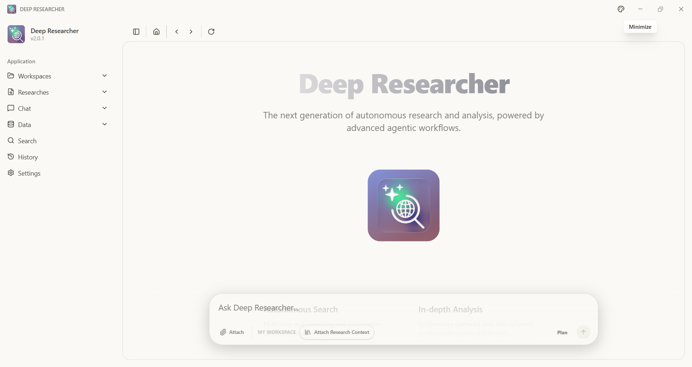
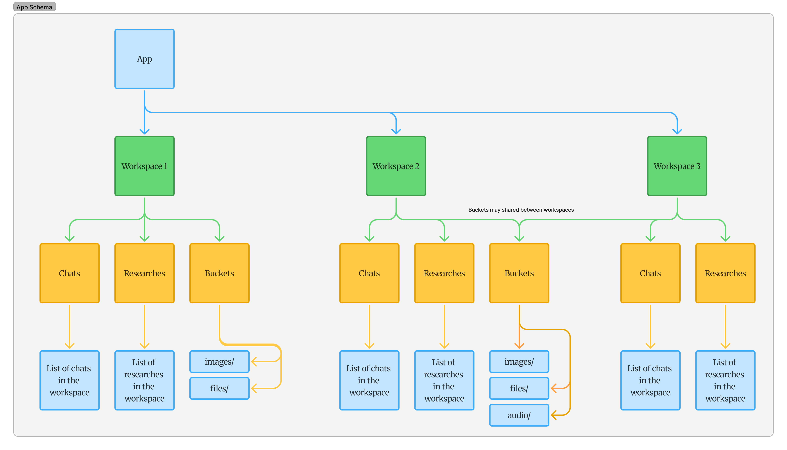
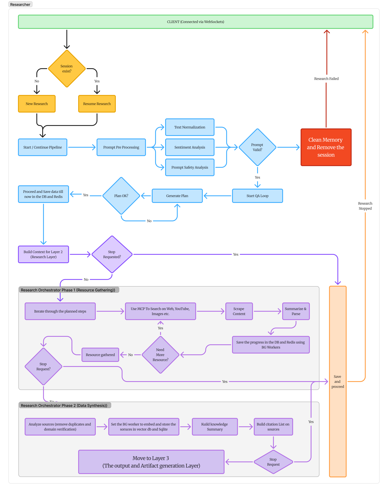
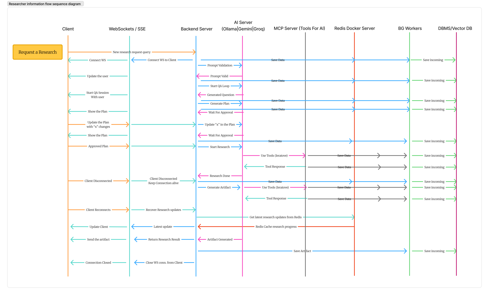
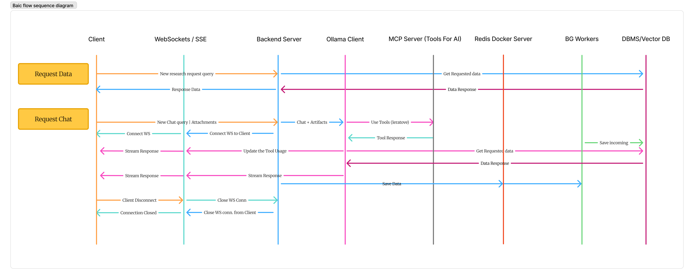

# Deep Researcher v2

**Version 2** — *Autonomously Synthesizing Global Knowledge*

<p align="center">
  
</p>

<p align="center">
  
</p>


---

Deep Researcher v2 is a complex research platform, that combines autonomous data gathering to deliver evidence-based insights. While the underlying architecture prioritizes functional delivery over strict efficiency—in short, it just works—it effectively acts as an intelligent analyst: reliably synthesizing information from the web, video, and structured sources into comprehensive, verifiable reports.

This is **Deep Researcher V2** — a major evolution from the original agent. The current version introduces multi-step reasoning, workspace-based organization, persistent storage with full auditability, and robust failure handling, replacing the earlier single-flow, file-only approach.

---

## System Overview

Deep Researcher V2 operates on a **hybrid local-first architecture**, bridging a high-performance native desktop client with an advanced autonomous research engine. Designed with **Harness Engineering** principles, the platform reliably orchestrates complex **Agentic Workflows** to synthesize global knowledge.

Moving beyond simple single-shot pipelines, the system leverages **multi-agent orchestration** and the **Model Context Protocol (MCP)** to dynamically coordinate external tools, unstructured data ingestion, and semantic retrieval (**RAG**). This structured approach ensures that the LLMs are deeply grounded in real-world data while minimizing hallucination.

The architecture is composed of three interconnected layers:
- **The Client Application (`app/`)**: A reactive, privacy-centric desktop shell providing workspace isolation, real-time **Chain-of-Thought** visualization, and structured artifact rendering.
- **The Intelligence Backend (`backend/`)**: A dedicated research engine managing stateful task decomposition, autonomous web navigation, and persistent SQLite-backed logging.
- **The MCP Tools Server (`MCP_Tools_Server/`)**: A robust, context-aware bridge that standardizes agent interactions with local utilities and external data streams.

Built for enterprise-grade verifiability, this infrastructure guarantees that every insight generated during a research cascade is traceable, cited, and durably stored.

---

## How It Works

Deep Researcher V2 is built from the ground up as a robust **Desktop Application**, ensuring that your data remains locally managed while delivering a seamless, high-performance user experience. 

### 1. App Workflow & Storage
Information at the user level is stored securely on your local machine using SQLite, organized into dedicated workspaces. This guarantees that your research history, chats, and structured artifacts are persistent, private, and always accessible.


### 2. Architecture Overview
The system orchestrates advanced multi-agent workflows by combining a local-first frontend with intelligent LLMs (Gemini/Ollama) and the Model Context Protocol (MCP).


### 3. How Autonomous Research Works
When you input a complex query, the system doesn't rely on a simple single-shot search. Instead, the Intelligence Backend decomposes the goal into actionable sub-tasks. Autonomous agents dynamically search the web, scrape content, and leverage RAG to retrieve relevant semantic data. The process is strictly iterative: the agent evaluates its findings against the original goal, formulates new queries to fill knowledge gaps, and ultimately synthesizes a comprehensive report backed by precise citations.


### 4. Data Processing, Chat, & Redis
In addition to deep research, the platform supports real-time chat and continuous data processing. **Redis** serves as the backbone for these high-speed operations. It acts as an in-memory caching layer and task queue, managing the state of asynchronous web scraping jobs, holding intermediate Chain-of-Thought reasoning steps, and ensuring ultra-low latency retrieval during live chat sessions and semantic searches.


---

## Features

- **Autonomous research agents** — Multi-step reasoning, browsing, and synthesis.
- **Chain-of-thought visualization** — Follow the agent’s logic and planning in real time.
- **Workspace-first design** — Organize work in dedicated workspaces with persistent context.
- **Structured artifacts & citations** — Findings and claims backed by citations for verifiability.
- **Database-backed storage** — Full logging, history, and fallback prevention (no “ghost” files).
- **Premium desktop experience** — Modern UI (React 19, Tailwind CSS 4, Framer Motion), cross-platform (Windows, macOS, Linux).

---

## Legacy: Deep Researcher V1

The previous generation ([**Legacy Deep Researcher V1**](https://github.com/pixelThreader/Deep-Researcher)) was a **simple reflex agent**: a single, predefined pipeline with minimal structure.

- **Single flow** — One fixed research pipeline; no multi-step orchestration.
- **File-only output** — All research stored in a single folder; no database or audit trail.
- **Basic discovery** — Title-based filter/search only.
- **Limited reliability** — No persistent logs, no fallback handling, and no guarantee that generated files were correctly recorded or recoverable.

V2 replaces this with workspaces, multi-step agents, database-backed storage, and robust file and log management. For the original codebase and releases, see the [legacy repository](https://github.com/pixelThreader/Deep-Researcher).

---

## Repository Structure

The project is split into two main components, each with its own setup and contribution guide:

| Component | Role | Documentation |
|-----------|------|----------------|
| **[`app/`](app/)** | Desktop shell: UI, workspaces, visualization | [Frontend README](app/README.md) |
| **[`backend/`](backend/)** | Research engine: APIs, crawlers, LLMs, storage | [Backend README](backend/README.md) |

### Frontend (`app/`)

- **Stack**: Electron, Vite, React 19, Tailwind CSS 4, Shadcn UI, Motion, Rive.
- **Responsibilities**: User interaction, workspace management, chain-of-thought and artifact visualization.

### Backend (`backend/`)

- **Stack**: Python 3.12+, FastAPI, Google Gemini, Ollama.
- **Responsibilities**: Task orchestration, web/data ingestion, LLM calls, database and file-bucket storage (with logging and fallbacks).

See the READMEs in `app/` and `backend/` for detailed structure, conventions, and development instructions.

---

## Quick Start

1. **Clone the repository**
   ```bash
   git clone https://github.com/pixelThreaderOfficial/Deep-Researcher.git
   cd Deep-Researcher
   ```

2. **Backend**  
   Follow the [Backend README](backend/README.md): set up `.env`, install dependencies with `uv`, and run the API (e.g. `uv run ./main.py`).

3. **Frontend**  
   Follow the [Frontend README](app/README.md): install Node dependencies in `app/`, configure `.env`, and run the desktop app (e.g. `npm run dev` in `app/`).

4. **Distribution**  
   Build installers from `app/`: `npm run dist:win`, `npm run dist:mac`, or `npm run dist:linux` (see [app/README.md](app/README.md)).

---

## Contributing

Contributions are welcome. Please open issues or pull requests in this repository. For component-specific guidelines, see [app/README.md](app/README.md) and [backend/README.md](backend/README.md).

---

*“The goal is not just to search, but to understand.”*  
— **pixelThreader & Team**
